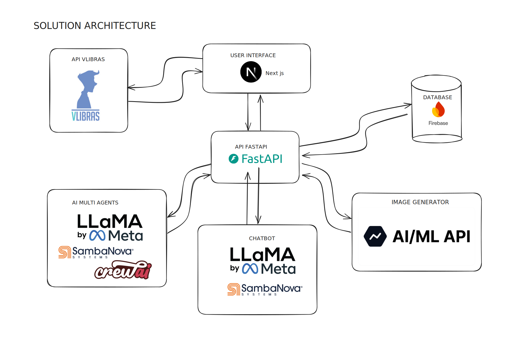

# Cris.ai Documentation

## Solution Overview

**Cris.ai** is a web platform designed specifically to address the challenges of teaching sign language to Brazilian children aged 4 to 10, focusing on the Brazilian Sign Language (Libras). This innovative platform bridges the educational gap faced by deaf children, particularly in low-income families, by empowering parents to teach their children Libras even if they have no prior knowledge. By integrating personalized, AI-driven tools and gamified learning experiences, Cris.ai ensures that education becomes accessible, engaging, and impactful for children and their families.

---

## General Scenario

The lack of accessible sign language education is a pervasive issue in Brazil, impacting not only families but also public schools, which often lack resources and trained professionals in Libras. Key challenges include:

### 1. Lack of Early Exposure to Libras
Children who do not have early exposure to Libras face significant developmental delays in language acquisition, cognitive abilities, and social interaction. This early linguistic gap can have long-term effects on their ability to succeed academically and socially. Parents often feel helpless when they lack knowledge of Libras, further compounding the issue.

> **Source**: CAMPOS, Ana. *Early Exposure to Sign Language and Its Impacts*. [RBEE, 2021](https://www.scielo.br/j/rbee/a/Kqj8bQqgrjHYjYjLx65B63p/).

### 2. Limited Access to Qualified Educators in Public Schools
Public schools in Brazil frequently lack the resources to hire or train educators proficient in Libras. This leaves many deaf children without proper support, creating an uneven playing field in education. Teachers and schools struggle to provide inclusive education, relying heavily on external resources or ad-hoc methods.

> **Source**: ROCHA, João. *Challenges in Libras Teacher Training*. [Educação Pública, 2022](https://educacaopublica.cecierj.edu.br/artigos/22/18/).

### 3. Inadequate Learning Materials
The scarcity of age-appropriate, engaging learning materials in Libras severely limits educational opportunities for children. Parents and educators often rely on general resources that are not tailored to the specific needs of young learners or their developmental stages.

> **Source**: SILVA, Pedro. *Educational Materials for Bilingual Deaf Education*. [Núcleo do Conhecimento, 2020](https://www.nucleodoconhecimento.com.br/educacao/inclusao-de-libras).

### Socioeconomic Barriers for Families
For families in low-income situations, accessing specialized sign language education or hiring private tutors is not feasible. Many parents lack the time and financial resources to seek external help, leaving their children at a disadvantage.

---

## Our Idea

### Core Vision
Cris.ai focuses on three key goals:

1. **Personalized Learning**: Leveraging AI to create tailored lesson plans that adapt to the needs and abilities of each child and their family.
2. **Accessibility**: Utilizing free or low-cost technology to ensure every family, regardless of income, can access quality Libras education.
3. **Educational Support**: Providing tools for both parents and schools to enhance learning experiences for deaf children in a collaborative environment.

The platform uses **LLama 2**, a state-of-the-art AI model, to generate personalized lesson plans. It also integrates **VLibras**, the Brazilian government’s sign language API, to convert AI-generated content into Libras, ensuring accurate and dynamic sign language representation.

---

### Impact on Families and Schools

#### Families
Empowers parents to actively participate in their child's learning journey. Cris.ai enables families to overcome communication barriers and build stronger emotional bonds.

#### Schools
Acts as a supplementary resource for public schools that lack qualified Libras educators. Teachers can use Cris.ai to enhance classroom inclusivity and provide personalized support for deaf students.

#### Children
Offers an engaging, gamified learning experience that motivates young learners and ensures consistent exposure to Libras.

---

## Personas

&emsp; Personas are semi-fictional profiles of ideal users, crafted from real data on their habits, behaviors, needs, and challenges. Developed through our insights about this topic, personas capture the key characteristics of different user groups. In product development, personas play an important role helping the developers understand users, their goals, and how they interact with the product, in order to develop a user-focused aplication.

### Persona: Cris

**Cris da Silva** is a 35-year-old construction worker in São Paulo, Brazil. He is the father of Pedro, a 6-year-old deaf child. Cris dreams of providing Pedro with a quality education but cannot afford private tutors or specialized resources. Despite his long work hours, Cris is determined to support his son and seeks an affordable, flexible, and easy-to-use solution.

&emsp;Cris faces significant challenges as a father trying to support his 6-year-old deaf son, Pedro. Without access to affordable resources, learning Libras — an important step for communication — feels out of reach. Public schools lack trained educators, leaving Pedro without adequate support in his education. The few existing materials available are often too expensive or not engaging enough for a young child like Pedro. Moreover, the additional expenses associated with inclusive education put a strain on Cris’s finances, especially as a construction worker with long hours and limited income.

&emsp;Cris envisions using the solution as a vital tool to support Pedro's education and development. With AI-generated personalized lessons tailored for Pedro’s age, Cris can ensure his son receives engaging and accessible content, even without prior experience with Libras. The platform allows him to learn alongside Pedro, building their communication skills together. Cris plans to incorporate the gamified learning features into their daily routine, making education an enjoyable activity despite his busy schedule. This solution not only provides an affordable way for Cris to support Pedro’s learning but also makes him part of his son’s learning journey.

### Persona: Pedro

**Pedro da Silva** is a 6-year-old deaf child living in São Paulo, Brazil. Despite the challenges he faces in communication and education, Pedro is curious, energetic, and eager to learn. He currently attends a public school that lacks trained Libras educators, leaving him unable to fully participate in class activities. At home, his father, Cris, strives to support his learning but struggles with limited resources and time.

&emsp;Pedro faces a lack of inclusive educational resources both at school and at home. The absence of Libras-trained teachers at his school prevents him from engaging fully with his peers and lessons. Traditional educational materials are not designed for children like Pedro, making it hard for him to stay motivated or progress at the same rate as other children his age. Furthermore, his father’s limited knowledge of Libras and long work hours restrict their ability to communicate and learn together.

&emsp; Pedro will use the solution to explore interactive, gamified lessons that make learning Libras both fun and accessible. Through personalized lessons tailored to his age and interests, Pedro can progress at his own pace, building confidence as he learns new skills. The platform’s engaging features, such as animations and games, will keep him motivated and focused, transforming his learning experience into an exciting daily routine. Additionally, with VLibras integration, Pedro will have access to accurate translations that enhance his understanding of the content and his ability to communicate effectively. By using the solution, Pedro will improve his language skills while enjoying the learning process.

---

## Value Proposition Canvas

Figure 1 - Value Proposition Canvas 

Source: Material produced by the authors (2024).

  

### Customer Profile

1. **Jobs**:
   - Learn Libras to communicate with their child.
   - Provide age-appropriate, quality education to their child.

2. **Pains**:
   - Lack of affordable resources for learning Libras.
   - Limited availability of engaging, child-friendly materials.
   - Public schools without trained Libras educators.
   - Inclusive education means additional expenses for families

3. **Gains**:
   - Affordable ways to teach they children
   - Interactive study, to keep their kids engaged
   - Be a part of their learning journey

### Value Map

1. **Products and Services**:
   - **AI-Generated Personalized Lessons**: Customized content for children aged 4 to 10.
   - **VLibras Integration**: Accurate Libras translations for all generated materials.
   - **Gamified Learning**: Age-appropriate features that make learning fun and interactive.

2. **Pain Relievers**:
   - Affordable platform for families with limited resources.
   - Intuitive tools that require no prior knowledge of Libras.
   - Educational support for schools with limited Libras-trained staff.

3. **Gain Creators**:
   - Fosters better communication and bonds between parents and children.
   - Enhances public school students inclusivity and effectiveness in learning Libras.
   - Provides better enviroment to these kids communicate e learn.

---

## Future Plans

### Short-Term Goals
1. Launch an MVP featuring AI-driven personalized lessons and VLibras integration.
2. Conduct testing with families and public schools to refine the platform.

### Medium-Term Goals
1. Expand gamification features, including progress tracking, badges, and family-based challenges.
2. Collaborate with public schools to adopt Cris.ai as a classroom aid for teaching Libras.

### Long-Term Goals
1. Integrate sign languages from other countries (e.g., ASL, BSL, LSF) to expand Cris.ai’s reach globally.
2. Develop real-time tools for speech-to-sign and text-to-sign capabilities, enhancing accessibility in diverse contexts.

---

## Technologies Details

### Software Architecture

  

---

### Components and Details

#### Frontend
- **Technology**: Next.js  
  - A modern React-based framework optimized for server-side rendering and static site generation.
- **Purpose**: User interface for seamless interaction with the platform.
- **Integrations**:  
  - Communicates with the backend to retrieve lesson plans and AI-generated content.  
  - Displays content translated into Libras and supports gamification features.

#### Backend
- **Technology**: FastAPI  
  - A Python-based framework for building APIs efficiently.
- **Purpose**: Orchestrates requests and core business logic.
- **Responsibilities**:
  - Manages AI models for content generation.
  - Coordinates with the VLibras API for sign language translation.
  - Implements gamification logic.
  - Personalizes learning paths based on user data.

#### AI/Multi-Agent System
- **Primary Model**: Llama 3.2 (SambaNova Systems)  
- **Multi-Agent Crew AI**: Tailors learning paths dynamically.
- **Image Generation**: Creates visual content related to lesson plans.

#### Database
- **Technology**: Firebase  
  - Provides real-time database capabilities and seamless integration with web apps.
- **Purpose**: Stores user data, learning progress, and gamification settings.

---

## References

1. CAMPOS, Ana. *Early Exposure to Sign Language and Its Impacts*. [RBEE, 2021](https://www.scielo.br/j/rbee/a/Kqj8bQqgrjHYjYjLx65B63p/).
2. ROCHA, João. *Challenges in Libras Teacher Training*. [Educação Pública, 2022](https://educacaopublica.cecierj.edu.br/artigos/22/18/).
3. SILVA, Pedro. *Educational Materials for Bilingual Deaf Education*. [Núcleo do Conhecimento, 2020](https://www.nucleodoconhecimento.com.br/educacao/inclusao-de-libras).

---

## Target Audience

Cris.ai is designed for:

1. **Children aged 4 to 10**: Offering fun, age-appropriate lessons to build fluency in Libras.
2. **Parents**: Providing accessible tools to learn Libras alongside their children.
3. **Public Schools**: Acting as a vital resource for educators to teach deaf children in inclusive classrooms.

By integrating cutting-edge AI with Libras, Cris.ai aims to revolutionize sign language education in Brazil, creating a brighter future for deaf children and their families.